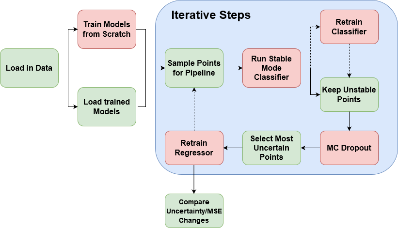

# UKAEA Group Project
Repository for the UCL CDT in DIS group project with UKAEA.

<!-- omit in toc -->
- [Installation:](#installation) 
- [Pipeline:](#pipeline)
- [Data Preparation:](#data-preparation)
- [Missing Outputs:](#missing-outputs)
- [QLKNN Reproduction:](#qlknn-reproduction)
- [Autoencoder:](#autoencoder)
- [Gaussian Process:](#gaussian-process)

## Installation:
To install the package run: `pip install .` in the root directory (installation via a setup.py file is deprecated). If you wish to make changes to the package you can install using `pip install -e .` which will install the package in editable mode.

## Pipeline:
The pipeline for the retraining of the classifier and regressors is included in the [pipeline](src/pipeline/) directory.

The pipeline consits of the following files:
- Models.py: Contains the classifiers, Regressors and dataset generators.
- pipeline_tools.py: Contains functions for each step of the pipeline.
- run_pipeline.py: Contains the main function for running the pipeline.

## Data Preparation:
The models used in the project take the .h5 file provided and convert it to pickled dataframes. The data is also split into a training, validation and test set at this point. This is done in [QLKNNDataPreparation.ipynb](src/notebooks/QLKNNDataPreparation.ipynb).

Initial data exploration can also be found in [DataExploration.ipynb](src/notebooks/DataExploration.ipynb).

## Missing Outputs:
A major difficulty in applying a neural network surrogate model to the data is that QuaLiKiz, which is used to train the surrogate, does not always map an input to an output.

It is therefore of interest to try and understand why this is the case. To do so a classifier is trained on the model inputs to determine if a given set of inputs gives a corresponding output. Classifier and results are shown in [Classifier.ipynb](src/notebooks/Classifier.ipynb) with hyperparameter tuning performed in [classifier_optimisation.ipynb](src/notebooks/classifier_optimisation.ipynb)

## QLKNN Reproduction:
- The QLKNN model is defined in [QLKNN.py](src/scripts/QLKNN.py)

- Trained using [train.py](src/scripts/train.py)

- Results evaluated in [RegressionOutputs.ipynb](src/notebooks/RegressionOutputs.ipynb)

## Autoencoder:
- The autoencoder is defined in [AutoEncoder.py](src/scripts/AutoEncoder.py)

- Trained using [train_ae.py](src/scripts/train_ae.py)

- Results evaluated in [AutoEncoderOutputs.ipynb](src/notebooks/AutoEncoderOutputs.ipynb)

- Variational Autoencoders are looked at in [VAE.ipynb](src/notebooks/VAE.ipynb)

## Gaussian Process:
- One dimensional gaussian processes are trained and plotted in [GaussianProcess.ipynb](src/notebooks/GaussianProcess.ipynb)
